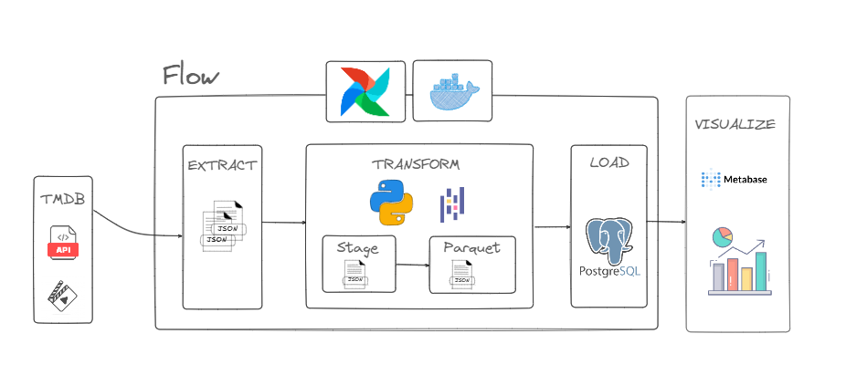

# 🎬 ETL Local Films

> Pipeline de dados para extração, transformação e carregamento de informações de filmes a partir de uma API pública, orquestrado com Apache Airflow em ambiente local via Docker.

---

## 📋 Índice

- [Sobre o Projeto](#-sobre-o-projeto)
- [Objetivos](#-objetivos)
- [Arquitetura](#️-arquitetura)
- [Tecnologias Utilizadas](#-tecnologias-utilizadas)
- [Estrutura do Repositório](#-estrutura-do-repositório)
- [Pré-requisitos](#-pré-requisitos)
- [Como Executar](#-como-executar)
- [Variáveis de Ambiente](#-variáveis-de-ambiente)
- [DAGs do Airflow](#-dags-do-airflow)
- [Fluxo ETL](#-fluxo-etl)
- [Metabase](#-metabase)
- [Contribuindo](#-contribuindo)

---

## 📌 Sobre o Projeto

O **ETL Local Films** é um pipeline de dados desenvolvido em Python que realiza a extração de dados de uma API de filmes, aplica transformações e carrega as informações em um destino estruturado. Todo o processo é orquestrado pelo **Apache Airflow**, utilizando **DAGs** (Directed Acyclic Graphs) para controle do fluxo de execução em modo batch.

O ambiente é completamente containerizado com **Docker Compose**, garantindo portabilidade e facilidade de configuração para execução local.

---

## 🎯 Objetivos

- **Extrair** dados de filmes (título, gênero, avaliação, elenco, etc.) de uma API pública de forma automatizada.
- **Transformar** os dados brutos aplicando limpeza, normalização e enriquecimento das informações.
- **Carregar** os dados processados em um destino estruturado (arquivo local, banco de dados ou outro formato analítico).
- **Orquestrar** todo o processo com Apache Airflow, garantindo rastreabilidade, reprocessamento e agendamento das execuções.
- **Containerizar** o ambiente com Docker para facilitar a reprodução do pipeline em qualquer máquina.
- Servir como projeto de estudo e portfólio para práticas de **Engenharia de Dados**.

---

## 🏛️ Arquitetura

O pipeline segue a arquitetura clássica de processamento em **batch**, onde os dados são coletados, processados e armazenados em etapas sequenciais controladas pelo Airflow.



> O diagrama acima representa o fluxo completo do pipeline: extração via API, transformação dos dados e carregamento no destino, tudo orquestrado pelo Airflow via DAGs e containerizado com Docker Compose.

---

## 🛠 Tecnologias Utilizadas

| Tecnologia | Versão | Finalidade |
|---|---|---|
| **Python** | 3.x | Linguagem principal do pipeline |
| **Apache Airflow** | 2.x | Orquestração das DAGs e agendamento |
| **PostgreSQL** | - | Banco de dados relacional para persistência dos dados |
| **Metabase** | - | Visualização e análise dos dados carregados |
| **Docker** | - | Containerização do ambiente |
| **Docker Compose** | - | Gerenciamento dos serviços locais |
| **uv** | - | Gerenciador de pacotes e ambiente virtual Python |
| **Requests / httpx** | - | Consumo da API de filmes |
| **Pandas** | - | Transformação e manipulação de dados |

> As dependências exatas estão em `pyproject.toml` e travadas em `uv.lock`.

---

## 📁 Estrutura do Repositório

```
ETLlocal-films/
│
├── config/                 # Configurações do ambiente (ignorado pelo git)
│   ├── .env                # Variáveis de ambiente sensíveis
│   └── airflow.cfg         # Configurações do Apache Airflow
│
├── dags/                   # DAGs do Apache Airflow
│   └── ...                 # Definição do fluxo ETL em batch
│
├── data/                   # Dados gerados pelo pipeline (ignorado pelo git)
│   └── ...                 # Arquivos brutos e processados
│
├── imgs/                   # Imagens e diagramas do projeto
│
├── logs/                   # Logs gerados pelo Airflow (ignorado pelo git)
│
├── notebooks/              # Notebooks de exploração e análise
│
├── plugins/                # Plugins customizados do Airflow
│
├── src/                    # Código-fonte do pipeline
│   └── ...                 # Módulos de extract, transform e load
│
├── main.py                 # Ponto de entrada / execução manual do pipeline
├── docker-compose.yaml     # Definição dos serviços Docker (Airflow, banco, etc.)
├── pyproject.toml          # Dependências e metadados do projeto (uv)
├── uv.lock                 # Lock file das dependências
├── .gitignore
└── README.md
```

> As pastas `config/`, `data/` e `logs/` são geradas localmente e estão no `.gitignore` — não são versionadas no repositório.

---

## ✅ Pré-requisitos

Antes de executar o projeto, certifique-se de ter instalado:

- [Docker](https://docs.docker.com/get-docker/) (versão 20+)
- [Docker Compose](https://docs.docker.com/compose/install/) (versão 2+)
- [Python 3.10+](https://www.python.org/) *(opcional, para execução local sem Docker)*
- [uv](https://github.com/astral-sh/uv) *(opcional, para gerenciamento de dependências Python)*

---

## 🚀 Como Executar

### 1. Clone o repositório

```bash
git clone https://github.com/DUCH18/ETLlocal-films.git
cd ETLlocal-films
```

### 2. Configure as variáveis de ambiente

O arquivo `config/.env` **não é versionado** (a pasta `config/` está no `.gitignore`). Crie-o manualmente antes de qualquer outra etapa:

```bash
mkdir -p config
touch config/.env
# Edite o arquivo com suas configurações (veja a seção Variáveis de Ambiente)
```

### 3. Configure o banco de dados (PostgreSQL)

Com o PostgreSQL em execução, acesse o CLI e configure o banco antes de subir o Docker Compose.

Se estiver rodando via Docker:

```bash
docker exec -it <nome_do_container_postgres> psql -U postgres
```

Ou localmente:

```bash
psql -U postgres
```

Dentro do CLI, execute:

```sql
-- Criar o usuário
CREATE USER <usuario> WITH PASSWORD '<senha>';

-- Criar o banco de dados
CREATE DATABASE films_db OWNER <usuario>;

-- Conceder privilégios de superusuário
ALTER USER <usuario> WITH SUPERUSER;

-- Verificar usuários e bancos criados
\du
\l

-- Sair
\q
```

> Substitua `<usuario>` e `<senha>` pelos valores definidos no `config/.env`.

### 4. Suba o ambiente com Docker Compose

```bash
docker-compose up -d
```

Aguarde todos os serviços iniciarem. Você pode acompanhar com:

```bash
docker-compose logs -f
```

### 5. Crie o usuário do Airflow

```bash
docker exec -it airflow-webserver airflow users create \
  --username airflow \
  --password airflow \
  --firstname Admin \
  --lastname User \
  --role Admin \
  --email admin@example.com
```

### 6. Acesse a interface do Airflow

Abra o navegador em:

```
http://localhost:8080
```

> Credenciais padrão: `airflow` / `airflow`

### 7. Ative a DAG

Na interface do Airflow, localize a DAG do projeto e clique em **Enable** para ativá-la. Você pode também disparar uma execução manual clicando em **Trigger DAG**.

### 8. Acesse o Metabase

Com o ambiente rodando, abra o Metabase no navegador:

```
http://localhost:3000
```

Na primeira vez, siga o assistente de configuração e conecte ao banco PostgreSQL usando as credenciais do `config/.env`. A partir daí você pode criar dashboards e explorar os dados carregados pelo pipeline.

### 9. Execução manual (opcional, sem Docker)

Se preferir executar o pipeline diretamente via Python:

```bash
# Instale as dependências com uv
uv sync

# Execute o pipeline
python main.py
```

### 10. Encerre o ambiente

```bash
docker-compose down
```

---

## 🔐 Variáveis de Ambiente

O arquivo `config/.env` **não é versionado** e deve ser criado manualmente antes de executar. Exemplo de variáveis esperadas:

```env
# Chave da API de filmes
API_KEY=sua_chave_aqui

# Banco de dados
host='localhost'
port='5432'
database='films_db'
user='<usuario>'
password='<senha>'
```

> ⚠️ A pasta `config/` (incluindo `.env` e `airflow.cfg`), `data/` e `logs/` estão no `.gitignore` e nunca devem ser commitadas com dados sensíveis.

---

## 🔄 DAGs do Airflow

As DAGs estão localizadas na pasta `dags/` e definem o fluxo de execução em batch do pipeline ETL. A estrutura típica de uma DAG segue o padrão:

```
extract_task >> transform_task >> load_task
```

**Principais tasks:**

| Task | Descrição |
|---|---|
| `extract` | Consome a API de filmes e salva os dados brutos |
| `transform` | Aplica limpeza, tipagem e enriquecimento nos dados |
| `load` | Persiste os dados transformados no destino final |

O agendamento (schedule) pode ser configurado diretamente na definição da DAG (ex: diário, horário, semanal).

> Os logs de execução são gerados localmente na pasta `logs/` (ignorada pelo git) e também ficam acessíveis direto pela interface web do Airflow em cada task.

---

## 🔁 Fluxo ETL

```
1. EXTRACT
   └─ Requisição HTTP para a API de filmes
   └─ Coleta de dados brutos (JSON)
   └─ Armazenamento temporário (staging)

2. TRANSFORM
   └─ Limpeza de campos nulos ou inconsistentes
   └─ Normalização de tipos de dados
   └─ Padronização de campos (datas, strings, etc.)
   └─ Possível enriquecimento com dados complementares

3. LOAD
   └─ Gravação dos dados processados
   └─ Destino: arquivo local (CSV/Parquet), banco de dados ou outro
```

---

## 📊 Metabase

O **Metabase** é a camada de visualização do projeto. Após o pipeline ETL carregar os dados no PostgreSQL, o Metabase permite explorar, filtrar e criar dashboards interativos sem necessidade de escrever SQL — embora também suporte queries manuais para análises mais avançadas.

**No contexto deste projeto, o Metabase é utilizado para:**

- Visualizar os dados de filmes carregados pelo pipeline (títulos, gêneros, avaliações, etc.)
- Criar gráficos e tabelas para análise exploratória dos dados
- Monitorar o volume de registros processados a cada execução do pipeline
- Facilitar a validação visual dos resultados das transformações

**Acesso:** após subir o ambiente com `docker-compose up -d`, o Metabase estará disponível em `http://localhost:3000`.

Na primeira execução, o assistente de configuração solicitará a conexão com o banco de dados. Utilize as mesmas credenciais definidas no `config/.env`:

| Campo | Valor |
|---|---|
| Tipo | PostgreSQL |
| Host | `localhost` |
| Porta | `5432` |
| Banco | `films_db` |
| Usuário | `<usuario>` |
| Senha | `<senha>` |

---

## 🤝 Contribuindo

Contribuições são bem-vindas! Siga os passos abaixo:

1. Faça um **fork** do repositório
2. Crie uma branch para sua feature: `git checkout -b feature/minha-feature`
3. Commit suas alterações: `git commit -m 'feat: minha nova feature'`
4. Push para a branch: `git push origin feature/minha-feature`
5. Abra um **Pull Request**

---

## 📄 Licença

Este projeto está sob a licença MIT. Consulte o arquivo `LICENSE` para mais detalhes.

---

<div align="center">
  <p>Desenvolvido por <a href="https://github.com/DUCH18">DUCH18</a></p>
</div>